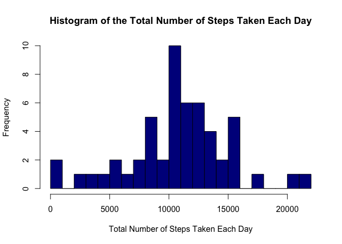
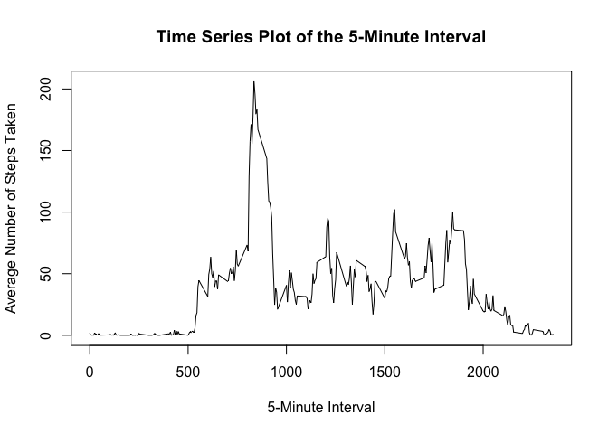
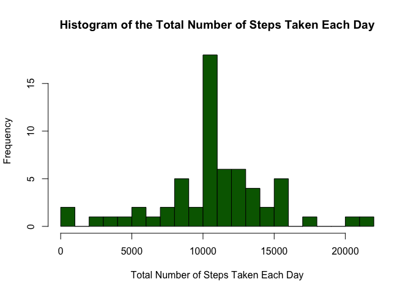
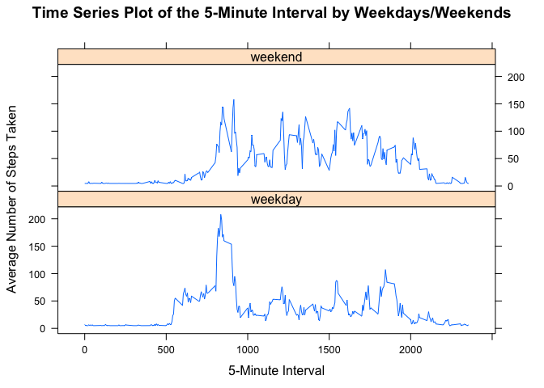

# Reproducible Research: Peer Assessment 1

## Loading and preprocessing the data


```r
# Load-in libraries
library(ggplot2)
library(scales)
library(Hmisc)
library(lattice)
```


```r
# check if the file exists
if(!file.exists('activity.csv')){
    unzip('activity.zip')
}

# raw data
activity <- read.csv('activity.csv')

# subset data frame to values with no NA for later use
activity_nona <- activity[complete.cases(activity),]
```


## What is mean total number of steps taken per day?

For this part of the assignment, you can ignore the missing values in the dataset.

1. Calculate the total number of steps taken per day


```r
# total number of steps taken per day
total_steps_day <- aggregate(steps ~ date, activity_nona, sum)
```

2. If you do not understand the difference between a histogram and a barplot, research the difference between them. Make a histogram of the total number of steps taken each day


```r
# plot histogram, using breaks purely for better visuals.
hist(
        total_steps_day$steps,
        col = "darkblue",
        main = "Histogram of the Total Number of Steps Taken Each Day",
        xlab = "Total Number of Steps Taken Each Day",
        breaks = 20
)
```

<!-- -->

3. Calculate and report the mean and median of the total number of steps taken per day


```r
# Mean
mean(total_steps_day$steps)
```

```
## [1] 10766.19
```

```r
# Median
median(total_steps_day$steps)
```

```
## [1] 10765
```


## What is the average daily activity pattern?

1. Make a time series plot (i.e. 𝚝𝚢𝚙𝚎 = "𝚕") of the 5-minute interval (x-axis) and the average number of steps taken, averaged across all days (y-axis)


```r
# the average number of steps taken, averaged across all days for each 5-minute

interval <- aggregate(steps ~ interval, activity_nona, mean)

plot(
        x = interval$interval,
        y = interval$steps,
        type = "l",
        main = "Time Series Plot of the 5-Minute Interval",
        xlab = "5-Minute Interval",
        ylab = "Average Number of Steps Taken"
)
```

<!-- -->

2. Which 5-minute interval, on average across all the days in the dataset, contains the maximum number of steps?


```r
interval[interval$steps==max(interval$steps),]
```

```
##     interval    steps
## 104      835 206.1698
```

## Imputing missing values

1. Calculate and report the total number of missing values in the dataset (i.e. the total number of rows with 𝙽𝙰s)


```r
# number of missing values
nrow(activity[is.na(activity$steps),])
```

```
## [1] 2304
```

2. Devise a strategy for filling in all of the missing values in the dataset. The strategy does not need to be sophisticated. For example, you could use the mean/median for that day, or the mean for that 5-minute interval, etc.

I am going to impute missing values as a daily averages

3. Create a new dataset that is equal to the original dataset but with the missing data filled in.


```r
# Impute misssing value based on daily average:
    activity_imp <- activity
    activity_imp$steps <- round(impute(activity$steps, fun=mean), digits = 0)
```

4. Make a histogram of the total number of steps taken each day and Calculate and report the mean and median total number of steps taken per day. Do these values differ from the estimates from the first part of the assignment? What is the impact of imputing missing data on the estimates of the total daily number of steps?


```r
# total number of steps taken per day (imputed dataset)
total_steps_day_imp <- aggregate(steps ~ date, activity_imp, sum)

# histogram
hist(
        total_steps_day_imp$steps,
        col = "darkgreen",
        main = "Histogram of the Total Number of Steps Taken Each Day",
        xlab = "Total Number of Steps Taken Each Day",
        breaks = 20
)
```

<!-- -->

```r
# Mean
mean(total_steps_day_imp$steps)
```

```
## [1] 10751.74
```

```r
# Median
median(total_steps_day_imp$steps)
```

```
## [1] 10656
```

```r
# Is there a difference?
data.frame(Measure=c('Mean', 'Median'), 
           Before_imputation=c(mean(total_steps_day$steps),
                               median(total_steps_day$steps)),
           After_imputation=c(mean(total_steps_day_imp$steps),
                              median(total_steps_day_imp$steps)))
```

```
##   Measure Before_imputation After_imputation
## 1    Mean          10766.19         10751.74
## 2  Median          10765.00         10656.00
```

There is only slight difference in Mean and Median when comparing values before imputation and after.
The impact of imputed values is only in smaller variance and more dense observation around the mean.

## Are there differences in activity patterns between weekdays and weekends?

1. Create a new factor variable in the dataset with two levels – “weekday” and “weekend” indicating whether a given date is a weekday or weekend day.


```r
activity_imp$dayType <- as.factor(ifelse(as.POSIXlt(activity_imp$date)$wday %in% c(0,6), 'weekend', 'weekday'))
```

2. Make a panel plot containing a time series plot (i.e. 𝚝𝚢𝚙𝚎 = "𝚕") of the 5-minute interval (x-axis) and the average number of steps taken, averaged across all weekday days or weekend days (y-axis). See the README file in the GitHub repository to see an example of what this plot should look like using simulated data.


```r
## the average number of steps taken, averaged across all days for each 5-minute
interval_imp <- aggregate(steps ~ interval + dayType, activity_imp, mean)
xyplot(
        steps ~ interval | dayType,
        interval_imp,
        type = "l",
        layout = c(1,2),
        main = "Time Series Plot of the 5-Minute Interval by Weekdays/Weekends",
        xlab = "5-Minute Interval",
        ylab = "Average Number of Steps Taken"
)
```

<!-- -->
